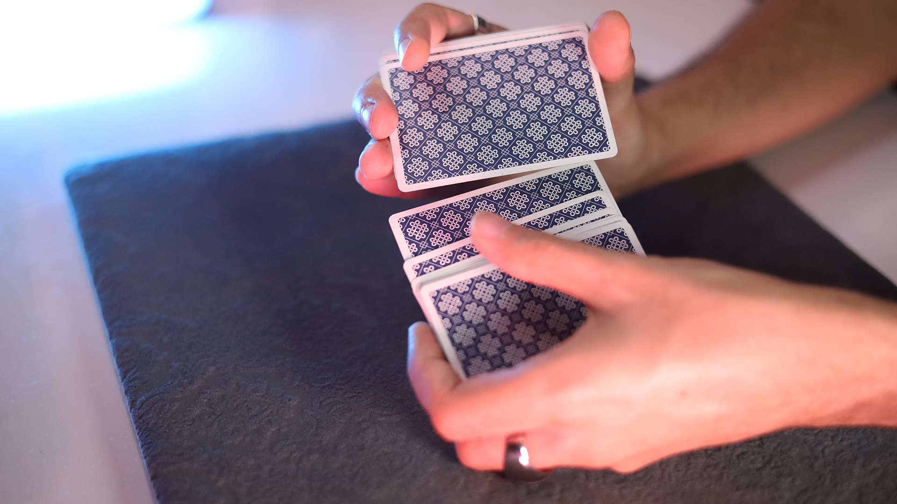
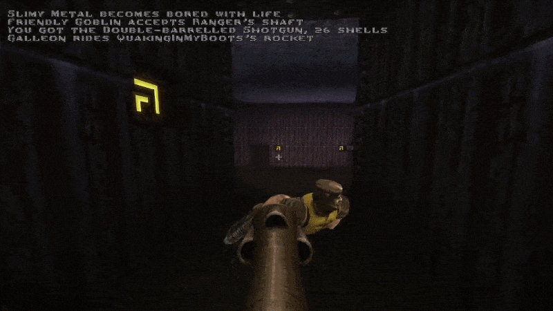

# Game Design
 

## What Does a Game Designer do?

A game designer is a part of the game development team. They are responsible for creating a game concept that determines how the game unfolds with its rules. For example, the game designer:

- Decides the play sequence
- Defines the probability of player actions 
- Designs the game’s start, end, and winning condition. 
- Uses a storyboard or screen mock-up.

Sometimes, a game designer can also be a game developer. In this case, they also take the responsibility of furnishing a game’s details, testing it to revise it per the player’s expectations.

### How do you start ?

**Start by hacking old games into new games**, Copy another game

## Pillars of Game Design

## MDA Framework

In my free time, I play boardgames quite a lot. To be honest not only play, but also read about them, analyse and try to design new ones. Some time ago I have discovered the [MDA framework](https://users.cs.northwestern.edu/~hunicke/MDA.pdf) – formal approach to game design, and you know what? I realised there are some universal truths that apply to product design in general, no matter whether product is a game or an IT system. In this article I will present you the MDA framework as it is and share with you my reflections in the context of IT systems design.

### Basics

Designer creates a game and player consumes it. So simple. Key point here is that they both look at a game from different perspectives and also act on it in a different way.

What is inside the box?

Again, it depends who you ask. A player would answer: “fun”, system (you can also describe it as a play) and rules which I need to follow. A designer: game mechanics, around which dynamics and resulting aesthetics are created.

The first set is called game components, while the second design counterparts. I’d like to focus on the latter– Mechanics, Dynamics and Aesthetics that stand for the framework abbreviation.

### MDA Layers

As already introduced, there are three layers of the MDA framework:

- Mechanics which describe components of the game – basically all the rules, algorithms and data.
- Dynamics which describe behaviours, plays and flow of the game, that emerge based on the mechanics provided.
- Aesthetics which describe desirable emotional reactions of the player when he/she interacts with the game.

As you may see, both actors interact with the game crossing all layers, but they have different starting points and so go through layers in reverse order. Form designer’s perspective, the mechanics give rise to the dynamics system behaviour, which in turn leads to particular aesthetics experiences. From the player’s perspective, aesthetics set the tone, which is born out in observable dynamics and eventually operable mechanics. The same game, two totally different ways to interact with it.

    Doesn’t the same apply to IT systems design – two very different perspectives? All the Agile effort is focused on fast product feedback loop, so how to get information from users as fast and as precise as we can? How to bring closer developers to users? How to make sure they will understand and consider users’ perspective which is often totally different than developers’?

Layers are the most important element of the MDA framework. In every game all three exist and interact between each other. Small change in one layer can cascade onto others. That is why more than 95% of the boardgame design time is consumed by testing – a designer does a small change in mechanics and observes how it impacts on dynamics and eventually aesthetics.

Let’s try to understand what exactly each layer is about.

### Mechanics

***Mechanics is a set of rules which support overall dynamics.***

---
 

**Chess: Size and layout of board, Different action for each pieces, Move one piece per turn, Check rule.**

---

**In poker we have for example: shuffling cards, card draw, betting or collection gathering, in Quake: weapons, armour, ammunition, obstacles, winning conditions and so on. Those are basic building blocks for the game.**

---

**In Quake: weapons, armor, ammunition, obstacles, winning conditions and so on.**

---

    Aren’t IT systems made of basic building blocks as well, like drag&drop functionality, multiselection, pop-ups, tooltips? I believe that in IT systems features reflects mechanics.

---

### Dynamics

Dynamics is something that arises from the given mechanics, and it’s players’ behaviour that can be observed while they interact with the game.

Let’s consider one of the oldest boardgame ever: chess. In chess tournaments both you and your opponent have predefined amount of time, and you need to win before your time passes. This is a rule (= mechanics), and the time pressure which comes from the rule is already dynamics. Mind that  this dynamic will be different for blitz game (3 minutes per game) and for more traditional games (like 2 hours per game).

Another dynamics that can be observed in chess is opening libraries. An opening is a set of initial moves that allow to open the game, and as there are many possibilities, professional players call the full collection of them the openings library. Every chess game starts from the same position on the board – that is the rule. The consequence, so the dynamics, is that after some time you find out that some openings give you significantly higher chance to win, so you learn them by heart and only use those in your games.

---

**Third chess dynamics is simply your opponent’s play.** The same applies to any game with more than one person involved  opponent’s actions and behaviours will influence the way you act and your decisions, and make you react in order to win.

---

**Poker** – another example. Many people believe that bluffing is mechanics, but in fact it’s not (even on boardgamegeek – most popular boardgames website– you will find bluffing listed as one of “rules”). There is nothing about bluffing in poker rules, not even a word. This is just dynamics which comes from the given set of rules, same as probability calculation, which every professional player learnt by heart.

    Isn’t dynamics user’s behaviour inside the system?

---

### Aesthetics

Aesthetics help us to describe gameplay needs for dynamics and mechanics. These are emotions that arise in a player when he/she interacts with the game.

Have a look on the list:

- Sensation: Game as sense-pleasure
- Fantasy: Games as make-believe
- Narrative: Game as drama
- Challenge: Game as obstacle course
- Fellowship: Game as social framework
- Discovery: Game as uncharted territory
- Expression: Game as self-discovery
- Competition: Game as rivalry

Now, let’s try to match some of these terms with two well-known video games: The Sims and Quake.

- **The Sims:** Discovery, Expression, Fantasy, Narrative
- **Quake:** Challenge, Sensation, Competition, Fantasy

Both can give you “fun”, but it will be totally different type of fun. What is important in aesthetics is that the type of “fun” which you would like to give to your players determines dynamics and mechanics needed. For example, to have proper Challenge you need to have adversaries who also want to win, you need clear winning conditions and the possibility to see current ranking and your position in it. Without such conditions, challenge factor will dramatically decrease.

    Isn’t this just like user experience in IT system design? Experience which we would like to provide to our users?

### How to use the MDA framework?

Let’s go through each layer of the MDA framework and analyse two modes if play which we can find in Quake – deathmatch and last man standing. Rules (= mechanics) are identical for both, except of two differences that determine conditions of win:

- In deathmatch, every time you die, you reborn immediately; In last man standing, the game ends immediately together with your first death;
- In deathmatch, you need to score 20 kills to win; In last man standing, you need to be… last man standing, so the only one who survives while all the other are killed.

Depending which mechanics you go for, dynamics and aesthetics will adjust accordingly:

In deathmatch:

- you try to search for opponents as fast as you can,
- you gather weapons to have more options to kill them,
- there is a lot of action and energy in any action you take.

In last man standing:

- you try to avoid opponents,
- you gather armour to be as much secure as you can,
- there is lots more of dramatic tension and fear that someone will eliminate you from the game.

Small change in mechanics, big impact on aesthetics, isn’t it?

### MDA framework for IT system design

Now, I’d like you to do an exercise. Look at the below picture, pick up 4 words and replace them to create a framework that could be applicable to IT systems.

Changing those words in original definitions for Aesthetics, Dynamics and Mechanics will also give an interesting effect: 

    User experience helps us to articulate design goals, discuss IT system flows and measure our progress as we tune the IT system.
    Processes help us to spot places where problems may occur or where IT system is not working as we expected.
    Features give us basic building blocks which support or disturb flowless processes.

---
## Game Design Document (GDD)
The purpose of a game design document is to unambiguously describe the game’s selling points, target audience, gameplay, art, level design, story, characters, UI, assets, etc…
In short, every game part requiring development should be included by the developer in enough detail for the respective developers to implement said part.

### What Consists a GDD?
While every project is different, you should consider including these things in your game design document:
- Your overall project goals
- Characters — ideally including concept art
- Story and game world — again, including concept art
- Level Design Mechanics and Gameplay
- User interface (UI)
- Music and audio
- Any working or playable prototypes
- Information about accessibility
- Details around marketing and commercialization

## GDD Examples

### **Pitch Documents**
[GTA 1 Pitch Document](https://www.gamedevs.org/uploads/grand-theft-auto.pdf)
[Diablo 1 Pitch Document](http://www.graybeardgames.com/download/diablo_pitch.pdf)

### **Full GDD Documents**
[Dirty Bomb](http://db-design.splashdamage.com.s3-eu-west-1.amazonaws.com/dirty_bomb-game_design_document.pdf)
[Deus Ex](https://drive.google.com/file/d/0B2_-knUokw90RzIwUEJsU2pYdWs/view?resourcekey=0-dqmq9k501fBUBDoUEgv4Sw)

---

## Resources:
### [MDA Article](https://4agile.pl/mda-framework-for-it-system-design/)
### [Half-Real](https://www.amazon.com/Half-Real-Video-between-Fictional-Worlds/dp/0262516519)
### [A Theory of Fun](https://www.amazon.com/Theory-Fun-Game-Design/dp/B00CVDU4JG)

